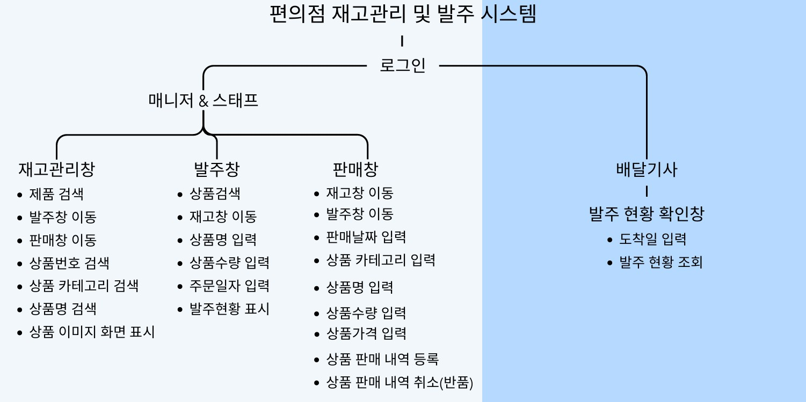
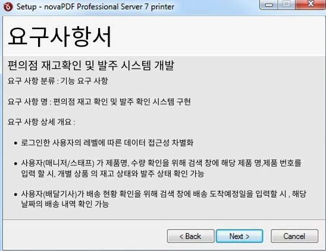
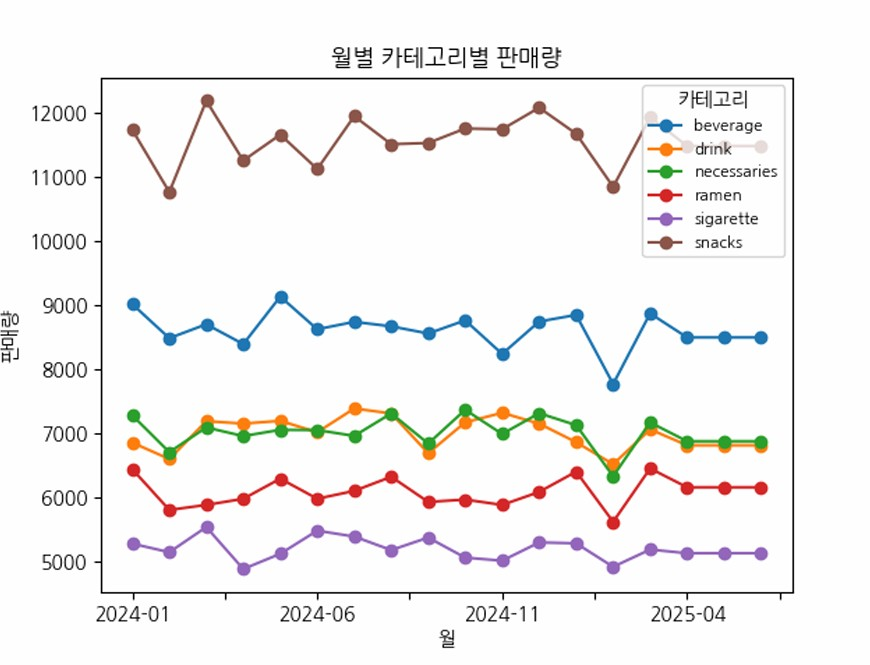
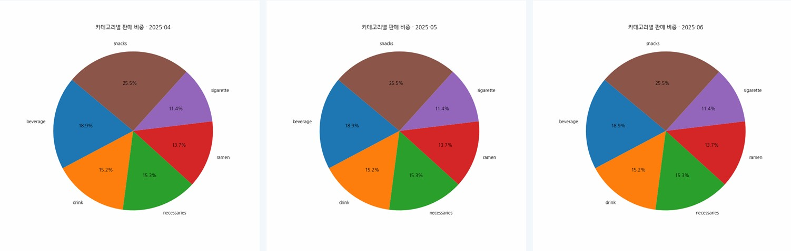

# 2025 부경대 자바개발자과정 MiniProject1 - 편의점 재고확인 및 발주 시스템

2025.03.25~2025.03.31 / 박수민, 이동호, 박세찬, 이경주

---

---

---

## 개발일정

### 1일차

1. 아이디어 구상 및 일정체크

2. 요구사항서 작성

3. DataBase 구조 설계

4. 요구사항 정의
   - 메인 화면 : 로그인
     - 아이디, 비밀번호가 일치하는 경우에만 로그인
     - 아이디, 비밀번호가 하나라도 일치하지 않는 경우 최 대 5회까지 기회를 주고 그렇지 않으면 로그인 불가
       - 아이디, 비밀번호 일치/불일치 확인
       - 로그인 실패 창 띄우기
   - 로그아웃 : 로그아웃
     - 시스템 종료 시 자동 로그아웃
   - 재고조회 : 재고현황 보기, 제품검색, 발주/판매 페이지 이동 버튼
     - 로그인 시 바로 재고 조회 페이지로 이동(단, 배달 기사는 전용 페이지로 이동) 재고 조회 페이지로 이동하면 등록된 전체 제품들의 상태 확인 가능
     - 제품 번호, 제품 명, 제품 카테고리 등을 검색하면 해당 검색 키워드에 맞는 내용 출력
       - 키워드에 맞는 이미지 띄움
     - 제품 번호, 제품 명, 제품 카테고리 등 내용에 맞지 않는 키워드를 검색 시 오류 발생 창을 띄움
       - 제품 번호, 제품 명, 제품 카테고리 등 키워드 불일치
       - 오류 발생 창을 띄워 알맞은 키워드를 입력하게 함
     - 프로그램 사용자가 발주, 판매 버튼을 클릭 시 해당 페이지로 이동
   - 발주조회 : 제품 발주, 발주 내역 수정, 발주 취소, 재고 페이지 이동 버튼
     - 상품 명, 상품 수량, 주문 일자를 입력하면 현재 시간을 기준으로 발주 내역이 나타남 입고 일자는 현재 날짜를 기준으로 3일 뒤에 배송 되도록 설정
     - 상품 명과, 변경된 수량을 입력하고 수정 버튼을 누르면 기존 발주 내역에서 수정한 내용으로 변경 됨
     - 제품 명을 입력하고 취소 버튼을 누르면 해당 제품 명의 발주 내역 전체 삭제
     - 발주 조회 페이지에서 조회 버튼 클릭 시 재고 조회 페이지로 이동
   - 상품판매 : 배달 리스트 확인
     - 배송 날짜를 입력하면 해당 날짜에 배송되는 상품의 목록과 수량을 조회 가능

### 2일차

- oracle 계정 생성과 Ui 디자인 설계
  - DBeaver, QT Designer 사용
- oracle과 Python 연동 및 이해

### 3일차

- DB 및 CRUD 기능 개발
- 활용 코드 개발
- 코딩 테스트

### 4일차

- 디버깅
- 코드 간소화 및 에러 해결

### 5일차

- 추가 테스트 및 마무리
- 코드 배포
- 발표용 PPT 작성

---

#### 데이터 시각화

#### 판매 예측 시각화

